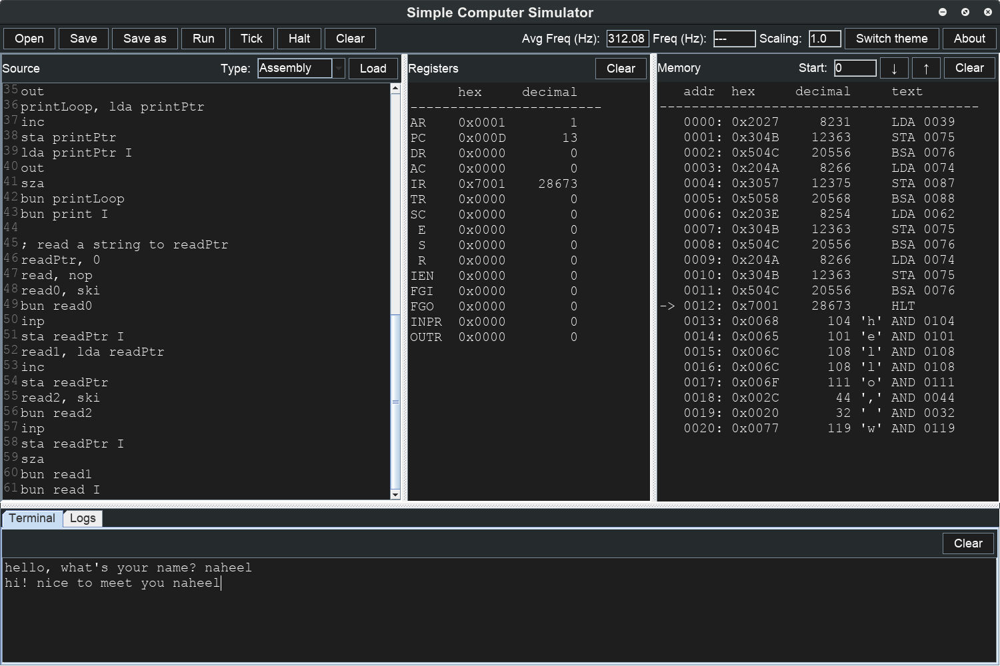

# Simple Computer Simulator

Simulate a simple computer architecture with GUI and CLI.
## Download
- [DOWNLOAD](https://raw.githubusercontent.com/Naheel-Azawy/Simple-Computer-Simulator/master/scs.jar) the jar
- [DOWNLOAD](https://raw.githubusercontent.com/Naheel-Azawy/Simple-Computer-Simulator/master/extra/scs.exe) the Windows exe
- `git clone https://github.com/Naheel-Azawy/Simple-Computer-Simulator.git`
## Architecture
### Registers and Flags:
- AR (Address Register)
- PC (Program Counter)
- DR (Data Register)
- AC (Accumulator)
- IR (Instruction Register)
- TR (Temporary Register)
- SC (Sequence Counter)
- E (ALU Flag)
- S (Start Flag)
### Instruction set
#### Memory-Reference Instructions:
- AND 
- ADD
- LDA
- STA
- BUN
- BSA
- ISZ
#### Register-Reference Instructions:
- CLA
- CLE
- CMA
- CME
- CIR
- CIL
- INC
- SPA
- SNA
- SZA
- SZE
- HLT
#### Input-Output
- INP
- OUT
- SKI
- SKO
- ION
- IOF
## Installing
You don't really need to install it, jump to the usage section!

Insisting? this will add a desktop shortcut and an executable (Linux users only)
```sh
$ ./install.sh
```
## Building
```sh
$ ./compile.sh
```
Or use Eclipse
## Usage
```
java -jar scs.jar [options] [file]
Options:
  -d: file is decimal text file
  -x: file is hexadecimal text file
  -b: file is binary text file
  -nogui: use command line interface
  -m: quit after finishing execution and only print that memory location
  -tick: Press 'Enter' to move to next clock cycle (only with -nogui)
  -q: quit after finishing execution
  -v: output version information and exit
  -h,?: display this help and exit
```
### Examples:
Normal GUI interface
```sh
java -jar scs.jar
```
Using CLI load a file in decimal
```sh
java -jar scs.jar -nogui -d '/file/path'
```
Note that is will start execution immediately unless option `-tick` is enabled
### Command Line Interface
```
Enter:          next clock
h,?:            help
q:              quit
savelog:        save log file
```
## Testing
```sh
./test.sh
```
Check the test files in `test` directory
## License
GPL
