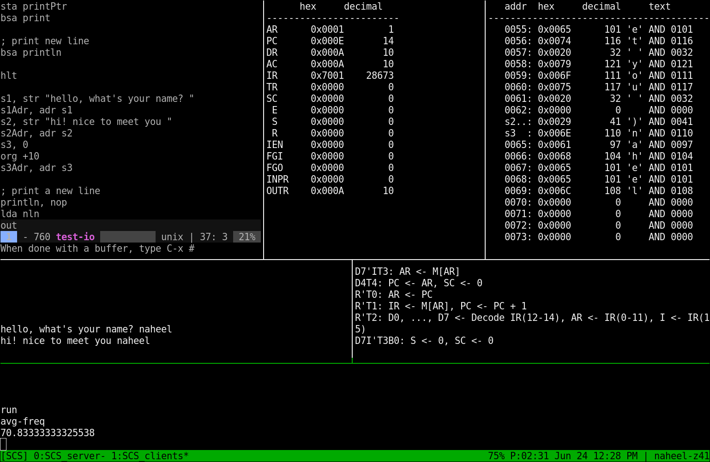

# Simple Computer Simulator

Simulate simple computer architectures
## Download (version 2.02)
- [DOWNLOAD](https://raw.githubusercontent.com/Naheel-Azawy/Simple-Computer-Simulator/master/scs.jar) the jar
- [DOWNLOAD](https://raw.githubusercontent.com/Naheel-Azawy/Simple-Computer-Simulator/master/extra/scs.exe) the Windows exe
- `git clone https://github.com/Naheel-Azawy/Simple-Computer-Simulator.git`

## Installing
You don't really need to install it, jump to the usage section!

Insisting? this will add a desktop shortcut and an executable (Linux users only)
```sh
$ ./install.sh
```
## Building
```sh
$ ./compile.sh
```
Or use Eclipse
## Usage
```
Usage: java -jar scs.jar [options] [file]
Options:
  -a, --architecture=ARCH        selects the computer archetecture [AC, BEN]
  -t, --file-type=TYPE           selects the input file type [ASM (default), HEX, BIN, DEC]
  -asm, --assemble               only assemble and output the result
  -asmf, --assembly-format=TYPE  selects the assembly output format [HEX (default), BIN, DEC]
  -nw, --no-window-system        use command line interface
  --server=PORT                  start in server mode
  --client=PORT [CMD]            start in client mode
  -v, --version                  output version information and exit
  -h, -?, --help                 display this help and exit
```
### Command Line Interface
```
set-mem-start     set memory start address
mem               show memory. `mem connect` to keep connected to memory updates
reg               show registers. `reg connect` to keep connected to register updates
log               show logs. `log connect` to keep connected to logs updates
all               show memory, register, and logs. `all connect` to keep connected updates
arch-help         help for the current computer architecture
set-arch          selects the computer architecture [AC, BEN]
load              load a file
load-type         load a file after selecting the type (e.g. `load-type AC file`)
reload            reload the file
clear             halt the computer and clear everything
clear-mem         clears the memory
clear-reg         clears the registers
clear-io          clears the I/O
run               run the computer
run-sync          run the computer synchronously (block input)
tick, t           tick the computer clock
stop, halt, hlt   halt the computer
terminal, trm     start the I/O terminal
echo              print to the screen. `$M[i]` to print a memory value at address `i`
clear-con         clear the console
about             program details
update            update the program
help, h, ?        show this help
exit, e           exit the program
```
### Examples of Usage:
Normal GUI interface
```sh
$ java -jar scs.jar
```
Using CLI load the test file in decimal, run it, display all details, and exit
```
$ java -jar scs.jar -nw -t dec ./test/test-dec -exec 'run-sync;all;exit'
   Memory                               | CPU Registers
   addr  hex     decimal     text       |       hex     decimal   
----------------------------------------|------------------------
   0000: 0x2004     8196     LDA 0004   | AR	0x0001        1    
   0001: 0x1005     4101     ADD 0005   | PC	0x0004        4    
   0002: 0x3006    12294     STA 0006   | DR	0xFFE9      -23    
-> 0003: 0x7001    28673     HLT        | AC	0x003C       60 '<'
   0004: 0x0053       83 'S' AND 0083   | IR	0x7001    28673    
   0005: 0xFFE9      -23     FFE9       | TR	0x0000        0    
   0006: 0x003C       60 '<' AND 0060   | SC	0x0000        0    
   0007: 0x0000        0     AND 0000   |  E	0x0001        1    
   0008: 0x0000        0     AND 0000   |  S	0x0000        0    
   0009: 0x0000        0     AND 0000   |  R	0x0000        0    
   0010: 0x0000        0     AND 0000   | IEN	0x0000        0    
   0011: 0x0000        0     AND 0000   | FGI	0x0000        0    
   0012: 0x0000        0     AND 0000   | FGO	0x0000        0    
   0013: 0x0000        0     AND 0000   | INPR	0x0000        0    
   0014: 0x0000        0     AND 0000   | OUTR	0x0000        0    
   0015: 0x0000        0     AND 0000   |-------------------
   0016: 0x0000        0     AND 0000   | Logs:
   0017: 0x0000        0     AND 0000   |-------------------
   0018: 0x0000        0     AND 0000   | R'T0: AR <- PC
   0019: 0x0000        0     AND 0000   | R'T1: IR <- M[AR], PC <- PC + 1
   0020: 0x0000        0     AND 0000   | R'T2: D0, ..., D7 <- Decode IR(12-14), AR <- IR(0-11), I <- IR(15)
   0021: 0x0000        0     AND 0000   | D7I'T3B0: S <- 0, SC <- 0
```
Run the test file in Ben's computer, display all, and exit
```
$ java -jar scs.jar -nw -a ben test/ben-test -exec 'run-sync;all;exit'
   Memory                               | CPU Registers
   addr  hex     decimal     text       |       hex     decimal   
----------------------------------------|------------------------
   0000: 0x14       20     LDA 0004   |  A	0x07        7    
   0001: 0x25       37 '%' ADD 0005   |  B	0x02        2    
   0002: 0xE0      -32     OUT        | ALU	0x07        7    
-> 0003: 0xF0      -16     HLT        | OUT	0x07        7    
   a   : 0x05        5     NOP        | PC	0x04        4    
   b   : 0x02        2     NOP        | IR	0xF0      -16    
   0006: 0x00        0     NOP        | MAR	0x03        3    
   0007: 0x00        0     NOP        | CF	0x00        0    
   0008: 0x00        0     NOP        | ZF	0x00        0    
   0009: 0x00        0     NOP        | SC	0x03        3    
   0010: 0x00        0     NOP        |  S	0x00        0    
   0011: 0x00        0     NOP        |-------------------
   0012: 0x00        0     NOP        | Logs:
   0013: 0x00        0     NOP        |-------------------
   0014: 0x00        0     NOP        | T0: CO MI
   0015: 0x00        0     NOP        | T1: RO II CE
```
Run the program using tmux on port 7777 with some options
```
$ ./scs-tmux.sh 7777 ./test/test-io "set-freq 70; set-mem-start 55"
```

Note that the `EDITOR` environment variable will be used to edit the source. If not defined, then it will go for emacs-client, emacs, vim, or nano.
## Assembler
```
ORG                 set the memory origin.
                    Examples:
                    ORG 50 ; start at address 50
                    ORG +5 ; start at address after 5 locations
                    ORG -5 ; start at address before 5 locations
ADR                 gets the address of a label.
                    Examples:
                    0: LDA A_ADR ; This will load 1
                    1: A, 5
                    2: A_ADR, ADR A
END                 declare the end of the program.
STR                 store a string of characters.
CHR                 store a character.
DEC                 store a decimal number.
HEX                 store a hexadecimal number.
BIN                 store a binary number.
```

More examples can be found inside the `test` directory.

## Architectures

### Accumulator Computer

```
A simple computer with a single accumulator register and I/O support.

Word size:      16 bits
Memory size:    4096 words

Registers:
AR:     Address Register
PC:     Program Counter
DR:     Data Register
AC:     Accumulator
IR:     Instruction Register
TR:     Temporary Register
INPR:   Input Register
OUTR:   Output Register
SC:     Sequence Counter
E:      Extended AC
S:      Start Flag
R:      Interrupt
IEN:    Interrupt Enabled
FGI:    Input Flag
FGO:    Output Flag

Instruction Set:
AND:    Logical AND memory with AC
ADD:    Arithmetic ADD memory with AC
LDA:    Load from memory to AC
STA:    Store AC to memory
BUN:    Branch unconditional
BSA:    Branch and save return address
ISZ:    Increment and skip if zero
CLA:    Clear AC
CLE:    Clear E
CMA:    Complement AC
CME:    Complement E
CIR:    Circulate right (AC and E)
CIL:    Circulate left (AC and E)
INC:    Increment AC
SPA:    Skip if positive AC
SNA:    Skip if negative AC
SZA:    Skip if zero AC
SZE:    Skip if zero E
HLT:    Halt
INP:    Input a character to AC
OUT:    Output a character from AC
SKI:    Skip if input flag
SKO:    Skip if output flag
ION:    Interrupt on
IOF:    Interrupt off
NOP:    No operation
```

### Ben's Computer

```
Even simpler computer built by Ben Eater on a breadboard.
https://www.youtube.com/user/eaterbc

Word size:      8 bits
Memory size:    16 words

Registers:
A:      Register A
B:      Register B
ALU:    ALU Register
OUT:    Output Register
PC:     Program Counter
IR:     Instruction Register
MAR:    Memory Address Register
CF:     Carry Flag
ZF:     Zero Flag
SC:     Sequence Counter
S:      Start Flag

Instruction Set:
NOP:    No operation
LDA:    Load from memory to A
ADD:    Add from memory to A
SUB:    Subtract memory from A
STA:    Store A to memory
LDI:    Load immediate
JMP:    Jump
JC:     Jump if carry
JZ:     Jump if A is zero
OUT:    Copy to output register
HLT:    Halt
```

## Testing
```sh
./test.sh
```
Check the test files in `test` directory

## License
GPL
